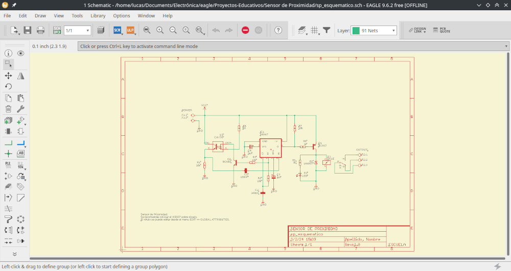
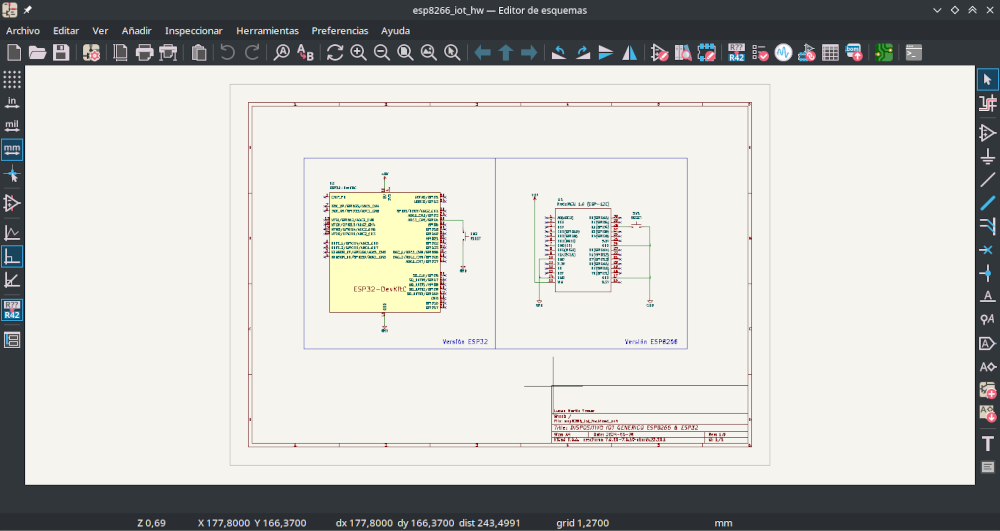
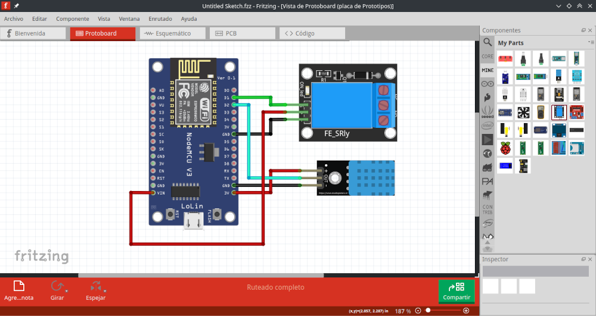
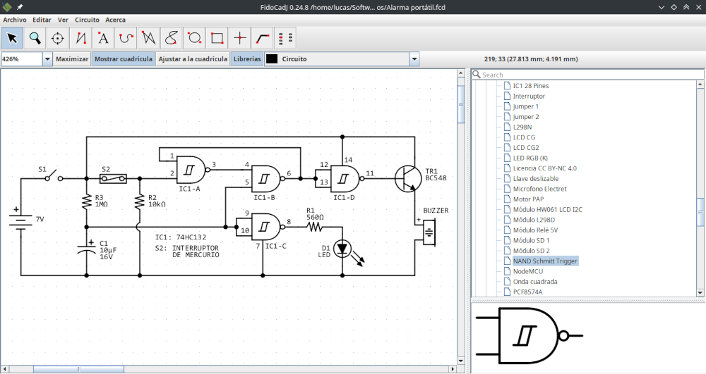

# PCB LIBs

Bibliotecas para el diseño de PCBs con los componentes más utilizados en los trabajos prácticos de las escuelas EEST N°3 y EEST N°5 de la ciudad de Mar del Plata. Además se incluyen bibliotecas para otros programas CAD que pueden ser útil en el diseño o en la generación de documentación.

La ultima versión se puede descargar desde el repositorio [en este enlace](https://github.com/lmtreser/pcb_libs/).

- `/EAGLE/treser_lib.lbr` Biblioteca compatible con Autodesk EAGLE v7 y superior.
- `/KiCad/Treser.3dshapes` Modelos 3D compatibles con KiCad v7.
- `/KiCad/Treser.pretty` Footprints compatibles con KiCad v7.
- `/KiCad/Treser.symbols` Symbols compatibles con KiCad v7.
- `/FidoCadJ/circuitos` Circuitos varios dibujados con FidoCadJ.
- `/FidoCadJ/ejemplos` Ejemplos varios dibujados con FidoCadJ.
- `/FidoCadJ/libs` Bibliotecas para FidoCadJ.
- `/Fritzing/parts` Bibliotecas para Fritzing.

#### Autodesk EAGLE

**EAGLE** (siglas de Easily Applicable Graphical Layout Editor) es un programa de diseño de diagramas y PCBs con autoenrutador famoso alrededor del mundo, debido a la gran cantidad de bibliotecas de componentes alrededor de la red. Autodesk Inc. adquirió a la empresa desarrolladora original, CadSoft Computer GmbH en 2016. [*Wikipedia*](https://es.m.wikipedia.org/wiki/EAGLE)

La última versión es la *9.6.2* y se puede descargar desde el sitio [Autodesk Legacy Software Versions](http://eagle.autodesk.com/eagle/software-versions/).

#### KiCad EDA

**KiCad** es un paquete de software libre para la automatización del diseño electrónico (del inglés: Electronic Design Automation, EDA). Facilita el diseño de esquemáticos para circuitos electrónicos y su conversión a placa de circuito impreso. KiCad fue desarrollado originalmente por Jean-Pierre Charras. Cuenta con un entorno integrado para captura esquemática y de diseño de PCB. Existen herramientas dentro del software para crear una lista de materiales, ilustraciones, archivos Gerber y vistas 3D de la PCB y sus componentes. [*Wikipedia*](https://es.m.wikipedia.org/wiki/KiCad).

La última versión de KiCad se puede descargar desde el sitio oficial [KiCad EDA](https://www.kicad.org/).

#### Fritzing

**Fritzing** es un programa libre de automatización de diseño electrónico que busca ayudar a diseñadores y artistas para que puedan pasar de prototipos (usando, por ejemplo, placas de pruebas) a productos finales. Fritzing fue creado bajo los principios de Processing y Arduino, y permite a los diseñadores, artistas, investigadores y aficionados documentar sus prototipos basados en Arduino y crear esquemas de circuitos impresos para su posterior fabricación. Además, cuenta con un sitio web complementario que ayuda a compartir y discutir bosquejos y experiencias y a reducir los costos de fabricación. [*Wikipedia*](https://es.m.wikipedia.org/wiki/Fritzing).

La última versión de Fritzing se puede descargar desde el [sitio oficial](https://fritzing.org/download/).

#### FidoCadJ

**FidoCadJ** es un editor gráfico vectorial para GNU/Linux, MacOSX, Windows y Android creado por el profesor Davide Bucci. Se distribuye bajo licencia GPL3 de forma gratuita, es muy liviano y se puede utilizar con distintos fines. Posee una gran colección de símbolos y footprints para electrónica y electricidad.

La última versión de FidoCadJ se puede descargar desde el [sitio oficial](http://darwinne.github.io/FidoCadJ/index.html).

## Recursos

- Autodesk EAGLE
  - [SparkFun Electronics Eagle Libraries](https://github.com/sparkfun/SparkFun-Eagle-Libraries)
  - [Adafruit Eagle Library](https://github.com/adafruit/Adafruit-Eagle-Library)
  - [UltraLibrarian](https://www.ultralibrarian.com/cad-vendors/eagle/)
  - [SnapMagic EAGLE](https://www.snapeda.com/eagle/)
  - [Autodesk Library.io](https://library.io/)
  - [Logos, dibujos y simbolos en EAGLE](https://www.automatismos-mdq.com.ar/blog/2011/07/logos-dibujos-y-simbolos-en-eagle.html)

- KiCad EDA
  - [KiCad Libraries](https://kicad.github.io/)
  - [SparkFun Electronics KiCad Libraries](https://github.com/sparkfun/SparkFun-KiCad-Libraries)
  - [SnapMagic KiCad](https://www.snapeda.com/kicad/)
  - [Digi-Key KiCad Library](https://github.com/Digi-Key/digikey-kicad-library)
  - [Performing A Circuit Simulation In KiCad](https://www.woolseyworkshop.com/2019/07/01/performing-a-circuit-simulation-in-kicad/)
  - [KiCanvas](https://blog.thea.codes/introducing-kicanvas/)
  - [CI/CD with KiCad and Gitlab](https://sschueller.github.io/posts/ci-cd-with-kicad-and-gitlab/)
  - [Pinion — Nice-looking interactive diagrams for KiCAD PCBs](https://yaqwsx.github.io/Pinion/)

- Fritzing
  - [Fritzing](https://fritzing.org/)
  - [AdaFruit Fritzing Library](https://github.com/adafruit/Fritzing-Library)
  - [Sparkfun Fritzing Parts](https://github.com/sparkfun/Fritzing_Parts)
  - [Cómo crear componentes personalizados para Fritzing](https://www.automatismos-mdq.com.ar/blog/2020/04/como-crear-componentes-personalizados-para-fritzing.html)

- FidoCadJ
  - [FidoCadJ](https://darwinne.github.io/FidoCadJ/)
  - [Editor gráfico FidoCadJ](https://www.automatismos-mdq.com.ar/blog/2020/06/editor-grafico-fidocadj.html)
  
- Otros Recursos
  - [Ngspice, open source spice simulator](https://ngspice.sourceforge.io/)

## Licencia

Este trabajo está protegido por la **Licencia MIT**. Puedes acceder a la versión original de la licencia (en inglés) a través del archivo [LICENSE](./LICENSE) o en línea en [The MIT License (MIT)](https://mit-license.org/). También proporcionamos una traducción no oficial desde [Wikipedia](https://es.m.wikipedia.org/wiki/Licencia_MIT#La_licencia):

Copyright (c) 2024 Lucas Martín Treser

Por la presente se concede permiso, libre de cargos, a cualquier persona que obtenga una copia de este software y de los archivos de documentación asociados (el "Software"), a utilizar el Software sin restricción, incluyendo sin limitación los derechos a usar, copiar, modificar, fusionar, publicar, distribuir, sublicenciar, y/o vender copias del Software, y a permitir a las personas a las que se les proporcione el Software a hacer lo mismo, sujeto a las siguientes condiciones:

El aviso de copyright anterior y este aviso de permiso se incluirán en todas las copias o partes sustanciales del Software.

EL SOFTWARE SE PROPORCIONA "COMO ESTÁ", SIN GARANTÍA DE NINGÚN TIPO, EXPRESA O IMPLÍCITA, INCLUYENDO PERO NO LIMITADO A GARANTÍAS DE COMERCIALIZACIÓN, IDONEIDAD PARA UN PROPÓSITO PARTICULAR E INCUMPLIMIENTO. EN NINGÚN CASO LOS AUTORES O PROPIETARIOS DE LOS DERECHOS DE AUTOR SERÁN RESPONSABLES DE NINGUNA RECLAMACIÓN, DAÑOS U OTRAS RESPONSABILIDADES, YA SEA EN UNA ACCIÓN DE CONTRATO, AGRAVIO O CUALQUIER OTRO MOTIVO, DERIVADAS DE, FUERA DE O EN CONEXIÓN CON EL SOFTWARE O SU USO U OTRO TIPO DE ACCIONES EN EL SOFTWARE.
